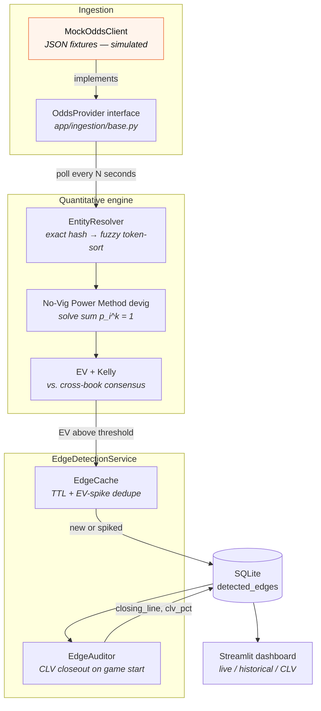

# LineEdge — Multi-Bookmaker Arbitrage & EV Detection Engine

LineEdge is a continuously-running quantitative edge-detection service for sports betting markets. It polls odds from multiple bookmakers, resolves inconsistent team/game naming onto canonical entities, strips bookmaker margin with a **No-Vig Power Method** devigger, and surfaces positive expected value (+EV) and arbitrage opportunities — then audits itself against the closing line.

It is structured like an algorithmic trading bot's poll/decide loop, minus order execution. **LineEdge never places a bet.** Its output is rows in SQLite and a dashboard.

> **All market data in this repository is SIMULATED.** There is no bookmaker integration. See [Limitations](#limitations).

> ### 🚧 Migration in progress: Python → Rust
>
> LineEdge is being rebuilt as **Edge**, a Rust trading engine for prediction
> markets (Kalshi, Polymarket) that goes beyond detection to order management,
> execution and risk. The Rust workspace lives in [`crates/`](crates/); the
> Python service documented below still runs and is the reference implementation
> until the migration completes. Build the Rust side with `cargo test`.
>
> Progress is tracked in [`docs/migration.md`](docs/migration.md).


---

## Table of contents

- [How it works](#how-it-works)
- [System architecture](#system-architecture)
- [Key features](#key-features)
- [Screenshots](#screenshots)
- [Demo notebook](#demo-notebook)
- [Setup](#setup)
- [Running it](#running-it)
- [Testing](#testing)
- [Project layout](#project-layout)
- [Limitations](#limitations)

---

## How it works

A bookmaker's quoted prices imply probabilities that sum to **more than 1**. The excess is their margin (the overround, or "vig"). To judge whether a price is good you first have to strip that margin out.

LineEdge devigs with the **power method**: find the exponent `k` such that

```
sum( p_i ^ k ) = 1
```

where `p_i` are the raw implied probabilities, solved by Newton–Raphson in [`app/engine/math_utils.py`](app/engine/math_utils.py). Unlike the naive multiplicative approach (`p_i / sum(p)`), the power method removes proportionally more margin from longshots, which better matches how books actually price the tails.

The service builds a **consensus** by averaging implied probabilities across every book quoting a market, devigs that consensus, and then compares each individual book's price against the consensus fair line. Where a book offers meaningfully longer odds than fair, that's an edge:

```
EV = p_fair * (decimal_odds - 1) - (1 - p_fair)
```

Detected edges are deduplicated, persisted, and — once the game starts — closed out against the market's final price to record **Closing Line Value (CLV)**, the standard honesty check on whether a model actually beat the market.

---

## System architecture



<details>
<summary>Same flow as plain text</summary>

```text
[ OddsProvider ] --poll interval--> [ Entity Resolution ] --> [ Quantitative Engine ]
                                            |                         |
                                    (Exact/Fuzzy Matching)   (No-Vig Power Method)
                                            v                         v
[ SQLite Storage ] <---------------------------------------- [ Edge Detection ]
      |                     |
      v                     v
[ Streamlit Dashboard ]  [ EdgeAuditor: CLV closeout on game start ]
```

</details>


Full write-up in [`docs/architecture.md`](docs/architecture.md). The rendered diagram is produced by [`scripts/render_architecture.py`](scripts/render_architecture.py).

---

## Key features

- **Continuous detection loop** — `EdgeDetectionService` polls on an interval with exponential backoff on failure, exactly like a trading bot's poll/decide cycle.
- **Entity normalization** — a two-tier resolver maps `"NY Rangers"`, `"Rangers"` and `"New York Rangers"` onto one canonical UUID: exact hash lookup first, RapidFuzz `token_sort_ratio` fallback second. Game resolution additionally requires a 6-hour start-time window, so the same fixture three days later won't false-positive.
- **No-Vig Power Method devigging** — solves `sum(p_i^k) = 1` by Newton–Raphson, better behaved than multiplicative devigging on multi-way markets and at the tails.
- **Cross-book consensus pricing** — fair odds come from the devigged average across all books, not from any single book's opinion.
- **Deduplication and caching** — `EdgeCache` suppresses repeat writes for a standing price unless the TTL lapses or EV moves past a spike threshold.
- **Closing Line Value audit** — `EdgeAuditor` closes out each market when the game starts, scoped per outcome, recording `clv_pct = implied(closing) − implied(offered)`. Positive means the flagged price beat the close.
- **Typed throughout** — pydantic models for odds payloads, pydantic-settings for config, SQLAlchemy 2.x typed ORM for storage.

---

## Screenshots

> **These screenshots show SIMULATED market data produced by the mock provider** (`scripts/market_sim.py` → `MockOddsClient`). The bookmaker names are real brands, but none of these prices came from them — every number was generated by a synthetic market model. The dashboard itself is real, and these are unedited Playwright captures of it running.

### Live market edges


The default view: every currently-active +EV opportunity, ranked by expected value, with headline counters for active edge count and max/average EV. Each row shows the price on offer, the devigged fair price it is being judged against, and the resulting EV, colour-scaled so the strongest edges stand out.

### Historical analytics


Edge-detection performance across the session — a time series of how many edges were flagged per polling cycle, plus a breakdown of total edges found by sport. This is the view for asking "is the detector firing steadily, or did one market spam it?"

### CLV audit


The self-audit. A scatter of predicted fair price against the market's actual closing price (tight clustering means the devigger tracked where the market settled), and the distribution of CLV across all closed-out markets. CLV is a *leading* indicator of edge — it says nothing about whether any individual bet would have won.

### Dashboard preview


The landing view, used as the preview image at the top of this README (the live edges tab as the app first loads).

All four captures are reproducible with [`scripts/capture_docs.py`](scripts/capture_docs.py), which drives the running Streamlit app with Playwright.

---

## Demo notebook

**[`notebooks/demo.ipynb`](notebooks/demo.ipynb)** is a fully-executed end-to-end walkthrough. It imports the *real* application modules — nothing is reimplemented for the demo — and goes from a synthetic market through to charted results:

1. Generate a synthetic multi-book market (`scripts/market_sim.py`)
2. Ingest it through the real provider interface (`app/ingestion/mock_provider.py`)
3. Resolve messy feed names onto canonical entities (`app/engine/resolver.py`)
4. **Devig one market by hand** — raw implied probabilities, the overround, the solved exponent `k`, and how the power method differs from the naive method (`app/engine/math_utils.py`)
5. Detect +EV edges and check the book set for arbitrage
6. Run 14 simulated polling cycles through `EdgeDetectionService`, persisting to SQLite
7. Read everything back through the storage layer and close markets out with `EdgeAuditor`

Outputs are saved in the file, so it renders on GitHub without running anything. To re-execute it (the `jupyter` CLI is not required):

```powershell
$env:PYTHONPATH = "."
python -c "import nbformat, nbclient; nb = nbformat.read('notebooks/demo.ipynb', as_version=4); nbclient.NotebookClient(nb, timeout=900, resources={'metadata': {'path': 'notebooks'}}).execute(); nbformat.write(nb, 'notebooks/demo.ipynb')"
```

### Charts from the notebook


Where the flagged edges land relative to the detection threshold. The long right tail is characteristic of a market with dispersed book pricing.


Mean EV of the edges flagged at each book. Books simulated with a wider margin and a stronger price bias drift further from the consensus fair line, so more of their prices trip the threshold.


How the flagged prices fared against the close: the share that beat the closing line, and per-edge CLV in percentage points of implied probability.

**Every figure above is derived from simulated data.** They characterise a synthetic market generator, not any real bookmaker, and they are not evidence that this or any strategy is profitable.

---

## Setup

### Prerequisites

- Python 3.11+
- Playwright + Chromium — only to regenerate the dashboard screenshots
- Graphviz — only to regenerate `docs/assets/architecture.png`

### Install

```powershell
git clone https://github.com/thompgt/sports-betting-app.git
cd sports-betting-app
python -m venv .venv
.\.venv\Scripts\Activate.ps1
pip install -r requirements.txt
```

Optional:

```powershell
playwright install chromium   # for scripts/capture_docs.py
```

### Configuration

Settings live in [`app/core/config.py`](app/core/config.py) and can be overridden by environment variables prefixed `LINEEDGE_`, or by a `.env` file:

| Setting | Env var | Default | What it does |
|---|---|---|---|
| `db_url` | `LINEEDGE_DB_URL` | `sqlite:///./lineedge.db` | Where detected edges are persisted |
| `poll_interval_seconds` | `LINEEDGE_POLL_INTERVAL_SECONDS` | `30` | Seconds between poll cycles |
| `ev_threshold` | `LINEEDGE_EV_THRESHOLD` | `0.02` | Minimum EV to record an edge (2%) |
| `edge_cache_ttl_minutes` | `LINEEDGE_EDGE_CACHE_TTL_MINUTES` | `15` | How long a recorded edge suppresses duplicates |
| `edge_cache_spike_threshold` | `LINEEDGE_EDGE_CACHE_SPIKE_THRESHOLD` | `0.02` | EV move that re-records a cached edge |
| `max_backoff_seconds` | `LINEEDGE_MAX_BACKOFF_SECONDS` | `300` | Ceiling on failure backoff |
| `mock_fixture_path` | `LINEEDGE_MOCK_FIXTURE_PATH` | `tests/fixtures/sample_odds_payload.json` | JSON odds fixture the mock provider reads |
| `canonical_seed_path` | `LINEEDGE_CANONICAL_SEED_PATH` | `app/ingestion/seed_data/canonical_entities.json` | Canonical teams/games seeded on first run |

---

## Running it

Set `PYTHONPATH` to the repo root first (PowerShell shown; use `export PYTHONPATH=.` on a POSIX shell).

**Continuous detection service** — the real poll/detect/persist loop:

```powershell
$env:PYTHONPATH = "."
python app/main.py
```

**Single poll cycle** — useful as a smoke test or in CI:

```powershell
$env:PYTHONPATH = "."
python app/main.py --once
```

**Populated demo database** — replays a multi-cycle simulated session through the real pipeline and leaves behind `lineedge_demo.db`, including CLV closeouts:

```powershell
$env:PYTHONPATH = "."
python scripts/seed_demo_db.py
```

**Dashboard** — reads whichever database `db_url` points at, so point it at the demo DB to reproduce the screenshots above:

```powershell
$env:LINEEDGE_DB_URL = "sqlite:///./lineedge_demo.db"
streamlit run app/ui/dashboard.py
```

**Regenerate documentation assets**:

```powershell
$env:PYTHONPATH = "."
python scripts/render_architecture.py   # docs/assets/architecture.png
python scripts/capture_docs.py          # the four dashboard screenshots (needs Playwright)
```

---

## Testing

```powershell
$env:PYTHONPATH = "."
python -m pytest tests/ -v
```

The suite covers the parts most likely to be quietly wrong:

| File | Covers |
|---|---|
| `tests/test_math_utils.py` | Odds conversion, implied probability, power-method devig convergence, EV, Kelly |
| `tests/test_resolver.py` | Exact and fuzzy team matching, alias handling, game resolution and the 6-hour window |
| `tests/test_ingestion.py` | Provider interface, fixture parsing, pydantic validation of odds payloads |
| `tests/test_storage.py` | Edge persistence, `EdgeAuditor` closeout, CLV sign, per-outcome closeout scoping |
| `tests/test_robustness.py` | Malformed payloads, degenerate odds, error paths |

---

## Project layout

```text
sports-betting-app/
├── app/
│   ├── core/          # Settings (pydantic-settings) and logging setup
│   ├── engine/        # Pure logic: resolver.py (entity matching), math_utils.py (devig/EV/Kelly)
│   ├── ingestion/     # OddsProvider interface + MockOddsClient, canonical seed data
│   ├── models/        # Pydantic schemas for odds payloads
│   ├── services/      # EdgeDetectionService: the continuous poll/detect/persist loop
│   ├── storage/       # SQLAlchemy models, DatabaseManager, repository, EdgeAuditor (CLV)
│   ├── ui/            # Streamlit dashboard
│   └── main.py        # Entry point (service, or --once)
├── docs/
│   ├── architecture.md
│   └── assets/        # Rendered diagram, dashboard captures, notebook charts
├── notebooks/
│   └── demo.ipynb     # Executed end-to-end walkthrough
├── scripts/
│   ├── market_sim.py           # Synthetic multi-book market generator
│   ├── seed_demo_db.py         # Replays a simulated session into a demo DB
│   ├── render_architecture.py  # Renders docs/assets/architecture.png
│   └── capture_docs.py         # Playwright dashboard screenshots
└── tests/
```

---

## Limitations

Read this before drawing any conclusion from anything above.

- **All odds are simulated.** Every price in this repository, in the screenshots, and in the demo notebook was generated by `scripts/market_sim.py`, a synthetic market model. None of it came from a bookmaker.
- **There is no real bookmaker integration.** The only provider implementation is `MockOddsClient`, which reads JSON fixtures off disk. `OddsProvider` exists as the swap point where a live feed would go, but no such feed is connected — and connecting one raises API terms, rate-limit, latency and licensing questions this project does not address.
- **Simulated markets are easier than real ones.** The generator produces price dispersion by construction. A real market is tighter, moves faster, and closes the gaps you find before you can act on them. The edge counts and EV figures here would not survive contact with a live book.
- **Detection only — nothing is executed.** No bet placement, no bankroll management, no account handling, no order routing. Kelly sizing is computed for illustration and acted on by nobody.
- **No settled-result data.** CLV is measured against a simulated closing price. The system never learns whether a flagged bet would have won, so nothing here is a backtest of profitability.
- **Real-world frictions are ignored.** Stake limits, account limiting and closure, withdrawal friction, line movement between detection and placement, and taxes are all outside the model.
- **Narrow market scope.** Only two-way `h2h` (moneyline) markets are handled. Spreads, totals and multi-way markets are not.
- **This is not financial advice.** LineEdge is an engineering demonstration of a data pipeline: ingestion, entity resolution, numerical methods, persistence, auditing and visualisation. It is not a betting system, not a recommendation to gamble, and not advice of any kind. Gambling carries real risk of financial loss. If gambling is causing you harm, support is available from [BeGambleAware](https://www.begambleaware.org/) or the [National Council on Problem Gambling](https://www.ncpgambling.org/).

---

*Built by [thompgt](https://github.com/thompgt) as a quantitative engineering exercise.*
