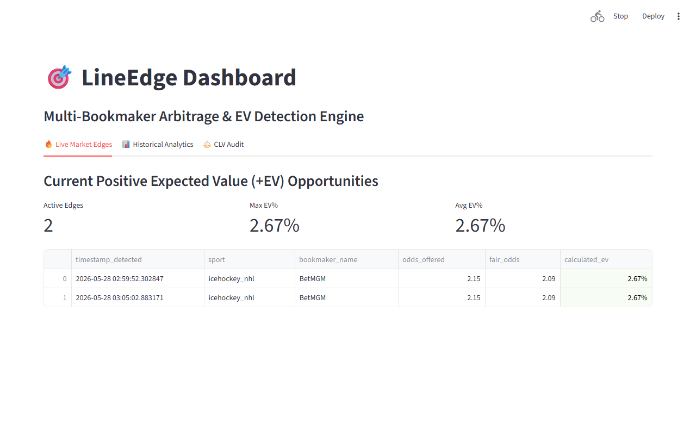
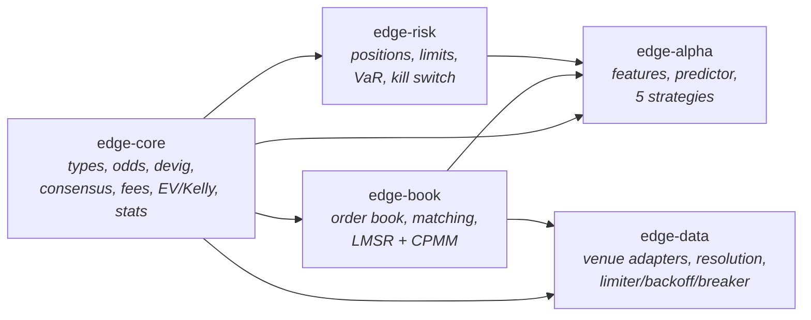
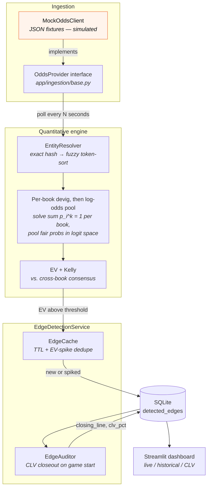
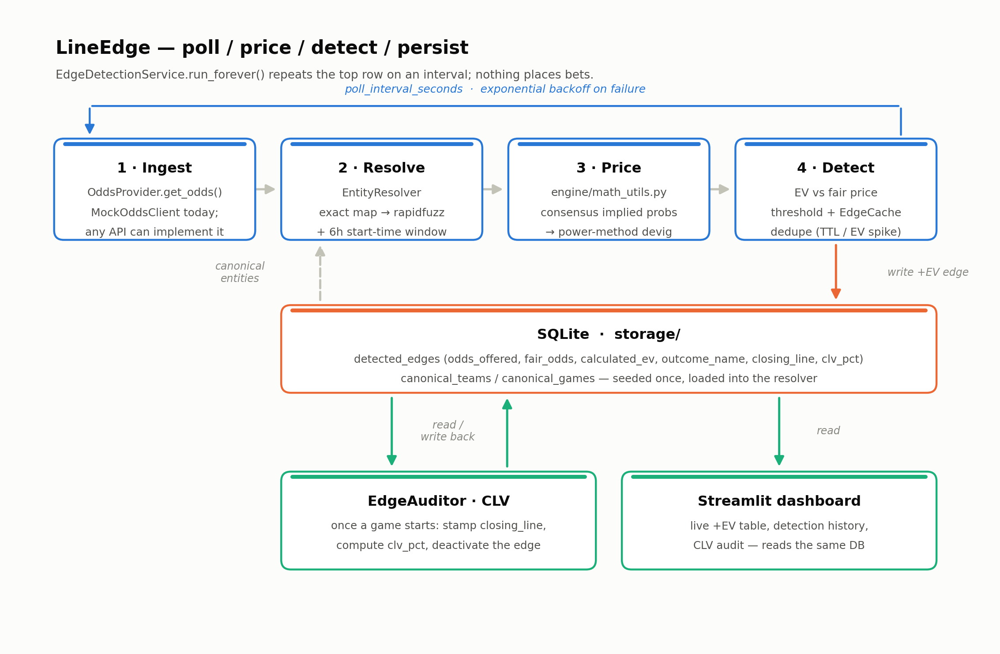
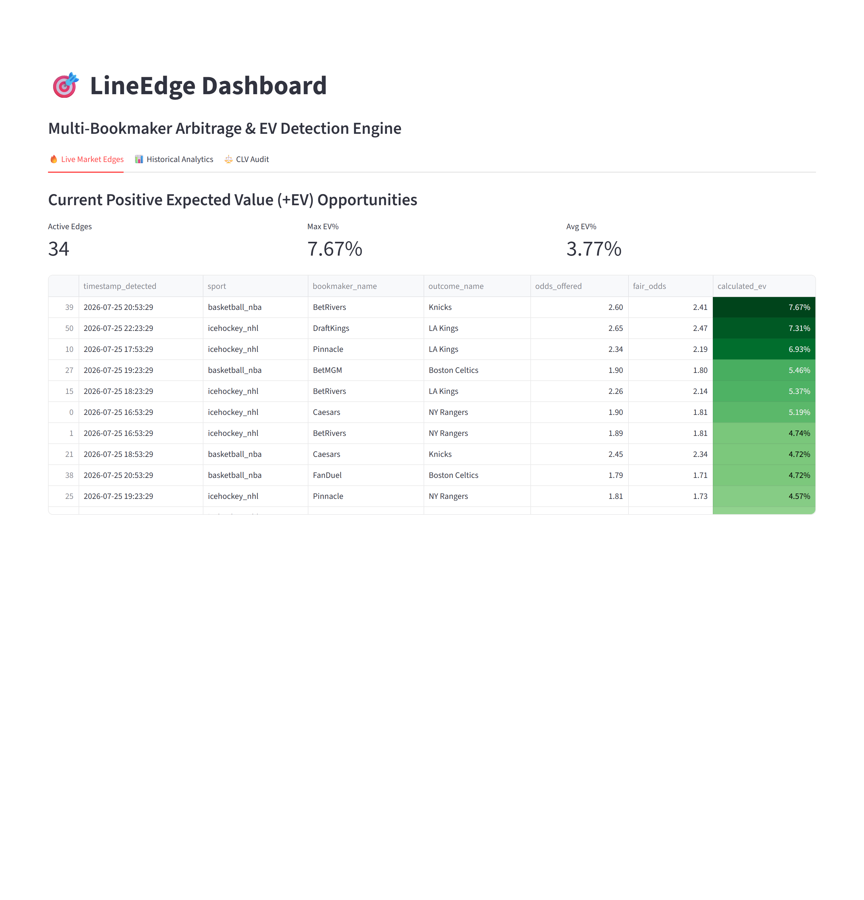
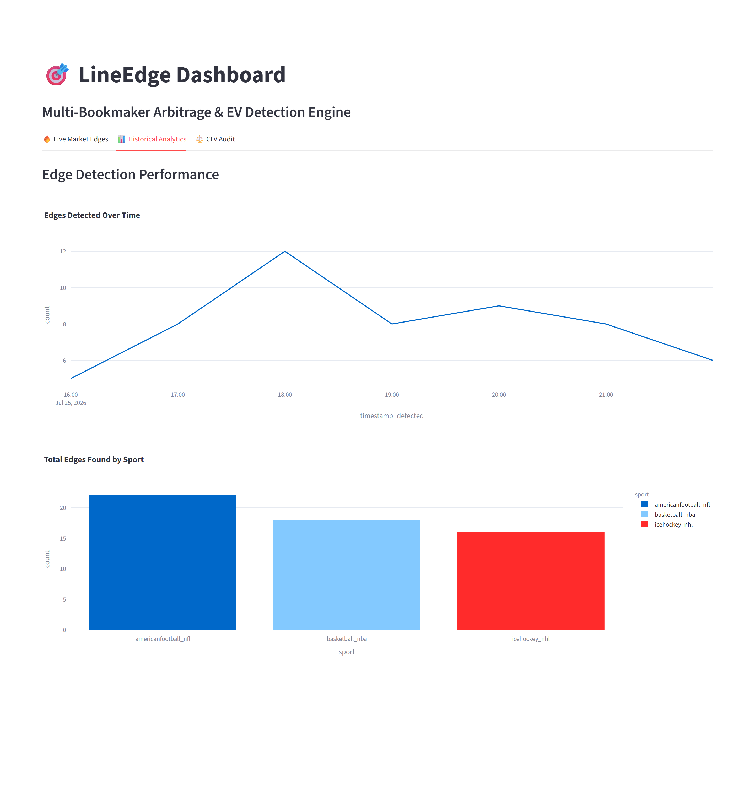
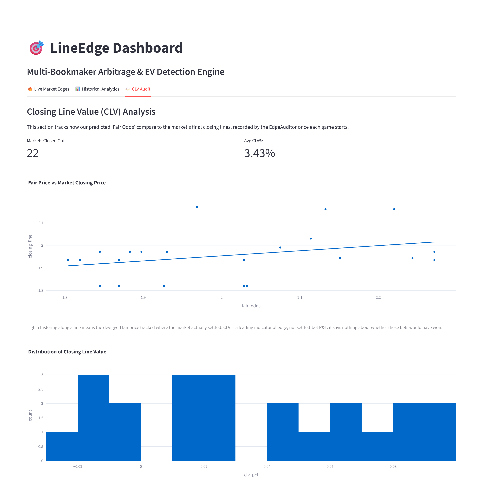
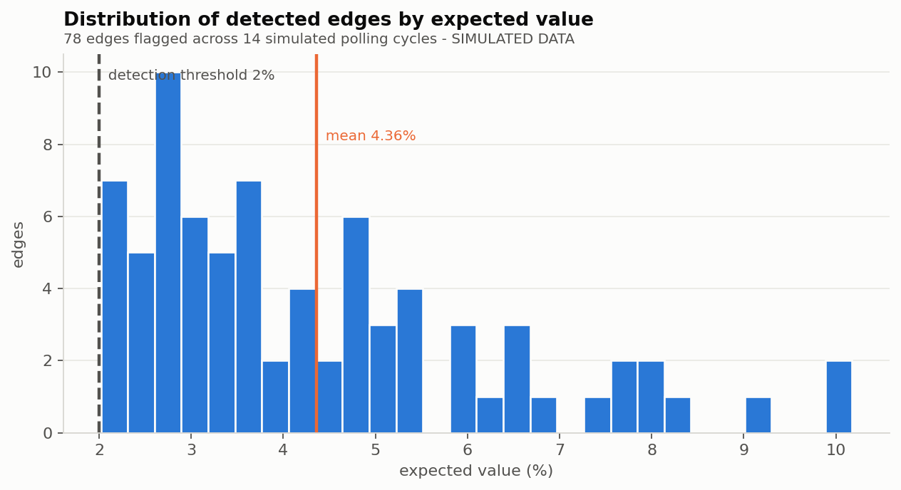
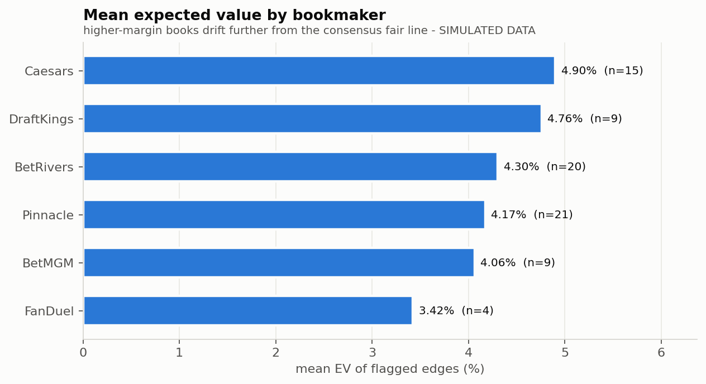
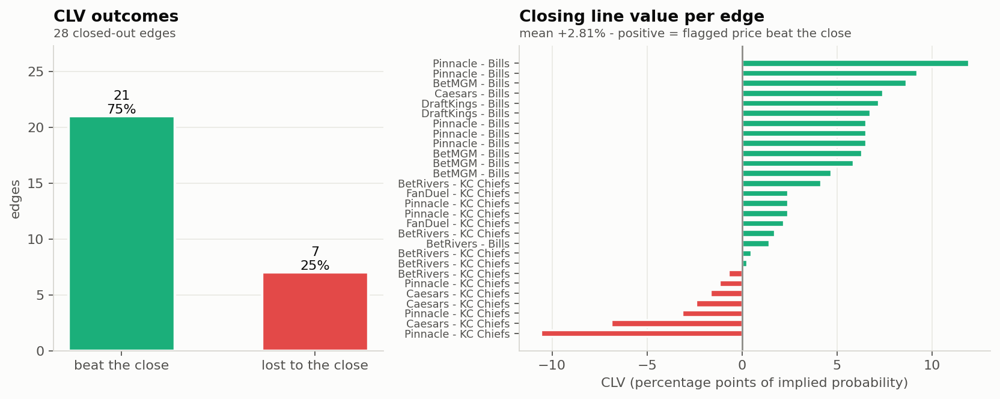

# LineEdge / Edge — Quantitative Edge Detection and Prediction-Market Trading Engine

A running Python service that devigs multi-bookmaker odds and surfaces +EV and arbitrage opportunities, plus a Rust workspace rebuilding it as a full prediction-market trading engine with an order book, risk layer and strategy framework.


> **All market data in this repository is SIMULATED.** There is no live bookmaker
> integration and no bet is ever placed. See [Limitations](#limitations).



---

## Why this matters

A bookmaker's quoted prices imply probabilities that sum to **more than 1**. The excess is their margin — the overround, or "vig". Before you can say whether a price is good, you have to strip that margin out, and the obvious way of doing it (divide every probability by the sum) is biased: it leaves too much probability on longshots and manufactures phantom edges on favourites. Getting that one step right, consistently, across venues that all name the same game differently, is most of the problem.

That makes this a concrete instance of a general engineering problem: **taking noisy, inconsistently-labelled, adversarially-priced data from several sources and turning it into one calibrated number you would act on.** The same shape appears in market data pipelines, forecast aggregation, and any system that has to reconcile disagreeing external feeds.

The stakes are also a good teacher of honesty. A detector that reports gross edges looks impressive and loses money: on a 50c prediction-market contract, Kalshi's taker fee alone is 1.75c, which exceeds the entire edge on most opportunities a scanner surfaces. So the system measures itself two ways it cannot fake — **expected value computed net of fees**, and **Closing Line Value**, the standard check on whether a flagged price actually beat where the market settled.

The Rust rebuild exists because detection is where a scanner stops and a trading system starts. Writing down an edge is easy; sizing it under estimation error, keeping it inside pre-trade risk limits, routing it, and being able to prove a backtest ran the same code as production is the part that decides whether any of it is real.

---

## Skills demonstrated

**Quantitative / numerical**

- Four devigging models — multiplicative, **power method** (`Σ p_i^k = 1`), **Shin** (solving for the implied insider fraction `z`), and additive — with bracketed solvers in Rust that cannot diverge, and a Newton–Raphson implementation in Python.
- **Log-odds (logit) pooling** of multiple venues into one fair value, devigging each source *before* pooling — in both the Rust consensus and the Python service — and returning pool dispersion as a first-class output.
- **Fractional Kelly sizing shrunk for estimation error**, fed by that dispersion, with a hard cap on any single position.
- **Monte Carlo VaR/CVaR** over Bernoulli resolution outcomes with shared latent draws for same-event markets and a common factor across events — because a normal approximation describes a different distribution than a binary payoff and thins exactly the tail it is meant to measure.
- Streaming estimators built for a hot path: Welford variance, EWMA, rolling windows, Brier/log scoring rules.
- **Online learning**: AdaGrad logistic regression on log loss that predicts the *residual* against the market logit, with Platt-style online calibration and a blend weight gated by demonstrated out-of-sample Brier skill.

**Systems / Rust**

- Cargo **workspace** (edition 2024, `resolver = "3"`) with five crates, workspace-wide dependency and profile management, `#![forbid(unsafe_code)]` throughout.
- A **limit order book** with no `O(log n)` in the hot path: flat tick-indexed level array, a 16-word `TickBitset` where best-bid is `leading_zeros`, and orders in an intrusive doubly-linked list over a slab so cancel is `O(1)` with no allocation.
- **Matching engine** with time-in-force, post-only, and self-trade prevention semantics.
- **Automated market makers** — LMSR and constant-product (CPMM) — behind one `MarketMaker` trait.
- **Purity as an architectural constraint**: no clocks, no I/O, no globals below the runtime layer; time is passed as data (`Ts`) so a backtest and a live session execute identical code.
- **Integer money**: prices as signed micro-dollars, interned integer ids, so equality in the matching engine is sound and PnL does not drift.
- Async ingestion with `tokio`, `reqwest`, `tokio-tungstenite`, `async-trait`; resilience as pure state machines — **token-bucket rate limiter, exponential backoff with jitter, circuit breaker**.
- Venue adapter design, including the Kalshi YES/NO dual-bid-stack reflection (`100 − p`) that is the easy way to get a plausible-looking, uniformly wrong book.

**Python / data engineering**

- Typed end to end: **Pydantic v2** payload schemas, **pydantic-settings** env-driven config, **SQLAlchemy 2.x** `Mapped[]` declarative ORM.
- `asyncio` polling service with capped exponential backoff, designed to run unattended.
- **Fuzzy entity resolution** with RapidFuzz `token_sort_ratio` behind an exact-hash fast path, plus time-window guards.
- **Streamlit + Plotly** dashboard; **Playwright**-driven screenshot capture; matplotlib-rendered architecture diagram; an executed **Jupyter** notebook that imports the real application modules rather than reimplementing them.
- **pytest** suite aimed at the parts most likely to be quietly wrong: solver convergence, CLV sign, per-outcome closeout scoping, malformed payloads, degenerate odds.

---

## Architecture

Two systems live here. The Python service (`app/`) is the working reference implementation. The Rust workspace (`crates/`) is the rebuild, tracked in [`docs/migration.md`](docs/migration.md).

### Component layout

```text
sports-betting-app/
├── Cargo.toml                  # Rust workspace: edition 2024, members = crates/*
├── crates/                     # ── Edge (Rust rebuild) ──────────────────────
│   ├── edge-core/              # Pure quant. No I/O, no clock, no globals.
│   │   └── src/ types.rs odds.rs devig.rs consensus.rs fees.rs ev.rs
│   │            stats.rs market.rs rng.rs error.rs
│   ├── edge-book/              # Order book, matching engine, AMMs
│   │   └── src/ book.rs bitset.rs order.rs engine.rs amm.rs latency.rs
│   ├── edge-risk/              # Position accounting, pre-trade limits, VaR, kill switch
│   │   └── src/ position.rs limits.rs engine.rs var.rs
│   ├── edge-alpha/             # Features, online predictor, strategies
│   │   └── src/ features.rs predictor.rs strategy.rs
│   │            strategies/{arbitrage,value,quoting,momentum,reversion}.rs
│   └── edge-data/              # Venue adapters, resolution, resilience
│       └── src/ source.rs http.rs venues/{kalshi,sim}.rs assembler.rs
│                resolve.rs similarity.rs limiter.rs backoff.rs breaker.rs time.rs
├── app/                        # ── LineEdge (Python service) ────────────────
│   ├── core/                   # pydantic-settings config, rotating-file logging
│   ├── engine/                 # resolver.py (entity matching), math_utils.py (devig/EV/Kelly)
│   ├── ingestion/              # OddsProvider ABC + MockOddsClient, canonical seed data
│   ├── models/schemas/         # Pydantic odds payload schemas
│   ├── services/               # EdgeDetectionService: poll → detect → persist loop
│   ├── storage/                # SQLAlchemy models, DatabaseManager, repository, EdgeAuditor
│   ├── ui/dashboard.py         # Streamlit dashboard
│   └── main.py                 # Entry point (service, or --once)
├── docs/                       # architecture.md, migration.md, assets/
├── notebooks/demo.ipynb        # Executed end-to-end walkthrough
├── scripts/                    # market_sim, seed_demo_db, render_architecture, capture_docs
└── tests/                      # pytest suite
```

The crate dependency graph is strictly layered — `edge-core` depends on nothing in the workspace, and everything above it is a function of its input event stream:



### Models

**Pricing models (`edge-core`, and the Python subset)**

| Model | Where | What it does |
|---|---|---|
| `DevigMethod::Multiplicative` | `crates/edge-core/src/devig.rs` | `π_i = p_i / Σp`. Cheap, biased toward longshots. Kept for comparison. |
| `DevigMethod::Power` (default) | same | Solves `Σ p_i^k = 1`. Removes proportionally more margin from longshots. Also `strip_vig_power_method` in `app/engine/math_utils.py` (Newton–Raphson). |
| `DevigMethod::Shin` | same | Shin (1993): margin as protection against informed traders; solves for insider fraction `z`. |
| `DevigMethod::Additive` | same | `π_i = p_i − (Σp − 1)/n`, clamped at zero. |
| Log-odds consensus pool | `consensus.rs` | Devigs each source, pools in log-odds with per-venue credibility weights and tail trimming, and returns dispersion (`estimate_sd`). |
| Fee models | `fees.rs` | `None`, `Kalshi { ceil(rate × C × P × (1−P)), takers only }`, `Bps { maker, taker }`, `WinningsOnly { rate }`. Every EV function takes one. |
| `EdgeAssessment` / `KellyPolicy` | `ev.rs` | EV net of fees by construction; Kelly at `fraction = 0.25`, `max_fraction = 0.05`, shrunk by `estimate_sd`. |
| LMSR / CPMM | `crates/edge-book/src/amm.rs` | Logarithmic market scoring rule and constant-product makers behind one `MarketMaker` trait. |
| Monte Carlo VaR / CVaR | `crates/edge-risk/src/var.rs` | Simulates resolution outcomes; one shared draw per event, common factor across events. `parametric_var` kept, labelled as the approximation it is. |

**Learned model (`edge-alpha`)**

- `Features` — 16 incremental microstructure features (`mid`, `microprice_edge`, `spread`, `imbalance_top`, `imbalance_depth`, `momentum_fast/slow`, `trend`, `volatility`, …), computed in constant time and space, with returns taken in log-odds and time-to-resolution as a first-class input.
- `Predictor` — AdaGrad logistic regression over standardised features with the **market logit as a fixed offset**, so it learns only the residual and an untrained model echoes the market exactly. Online Platt calibration on the residual score; the blend weight against the market price is driven by realised out-of-sample **Brier** skill, so a model with no demonstrated edge has no influence and generates no trades.
- Strategies (`strategies/`), each a pure function of a market snapshot into intents:

  | Strategy | Trades on | Liquidity |
  |---|---|---|
  | `Arbitrage` | mutually exclusive legs costing under $1 | takes |
  | `ValueTaker` | model or consensus disagreeing with the touch | takes |
  | `QuoteMaker` | the spread, leaned against inventory | makes |
  | `Momentum` | a move that order flow confirms | takes |
  | `MeanReversion` | a move that order flow does *not* confirm | makes |

  There is deliberately no separate "ML strategy": the predictor feeds `MarketView::independent_fair`, which the value taker and the maker already consume.

**Data models (Python service)**

- SQLAlchemy 2.x ORM (`app/storage/models.py`): `DetectedEdge` (`canonical_game_id`, `sport`, `market_type`, `bookmaker_name`, `outcome_name`, `odds_offered`, `fair_odds`, `calculated_ev`, `timestamp_detected`, `is_active`, `closing_line`, `clv_pct`, plus a composite index on game/market/book), `CanonicalTeam` (id, name, `aliases_json`), `CanonicalGame` (id, home/away team ids, sport, `start_time`).
- Pydantic v2 payload schemas (`app/models/schemas/odds.py`): `OddsEvent → Bookmaker → Market → Outcome`.
- Rust domain types (`crates/edge-core/src/types.rs`): `Price` in micro-dollars (`MICROS = 1_000_000`), validated `Prob`, `Ts` nanoseconds-since-epoch, and interned `MarketId` / `EventId` / `VenueId` / `OrderId` / `StrategyId`.

### Python service data flow





Full write-up in [`docs/architecture.md`](docs/architecture.md); the rendered PNG comes from [`scripts/render_architecture.py`](scripts/render_architecture.py).

---

## How it works

### The Python service, end to end

1. **Start up.** `app/main.py` loads `Settings` (env-prefixed `LINEEDGE_*`), configures rotating-file logging, opens the database, seeds canonical teams and games from `app/ingestion/seed_data/canonical_entities.json` if the tables are empty, and loads them into an `EntityResolver`.
2. **Poll.** `EdgeDetectionService.run_forever()` calls `poll_once()` on an interval. The only provider implementation, `MockOddsClient`, reads a JSON odds fixture; `OddsProvider` is the swap point where a live feed would go. An exception during a cycle triggers capped exponential backoff instead of crashing the process.
3. **Resolve.** Feed names are mapped onto canonical entities: exact hash lookup first, RapidFuzz `token_sort_ratio` fallback second, so `"NY Rangers"`, `"Rangers"` and `"New York Rangers"` collapse to one UUID. Game resolution additionally requires the start time to fall within a 6-hour window, so the same fixture three days later does not false-positive.
4. **Price.** Each book's American odds become decimal odds, then implied probabilities. **Each book is devigged on its own** with the power method — solving `Σ p_i^k = 1` by Newton–Raphson — against its own overround, and only then are the resulting fair probabilities **pooled across books in log-odds space** and renormalised onto the simplex. The order matters: averaging vigged probabilities first and devigging the average strips a margin no book actually quoted, so one fat-margin book drags every other book's fair price with it. This mirrors `consensus()` in `crates/edge-core/src/consensus.rs`.

   Outcomes are matched **by name, never by position**. Feeds list a market's outcomes in whatever order they please, so indexing positionally pairs one book's home fair probability with another book's away price — a large phantom edge that looks exactly like a real one. Books quoting a different outcome set from the consensus (a three-way line with a draw among two-way moneylines) are not comparable and are excluded with a warning rather than mis-indexed.
5. **Detect.** Each individual book's price is judged against the consensus fair line:

   ```
   EV = p_fair * (decimal_odds - 1) - (1 - p_fair)
   ```

   Anything above `ev_threshold` (default 2%) is an edge.
6. **Deduplicate.** `EdgeCache` keys on `(game, market, bookmaker)` and suppresses a repeat write for a standing price unless the TTL lapses or EV moves past the spike threshold — otherwise a single unchanged price would be re-recorded every cycle. Entries past their TTL are purged at the end of every poll, and a game's cache and last-seen-price entries are released once it closes out, so the working set stays bounded over a long unattended run.
7. **Persist.** Surviving edges are written to the `detected_edges` table in SQLite.
8. **Audit.** Once a canonical game's start time has passed, `EdgeAuditor.close_out_market()` marks its active edges inactive, records the last-seen price as the closing line, and computes `clv_pct = implied(closing) − implied(offered)`, scoped per outcome. Positive CLV means the flagged price beat the close. Whether a game still has anything to close is read from the `is_active` flag rather than from process memory, so a restart does not re-close games and overwrite closing lines already recorded.
9. **Display.** The Streamlit dashboard reads the same database — live edges ranked by EV, historical detection counts per cycle and by sport, and the CLV audit (predicted fair vs. actual close, plus the CLV distribution).

### The Rust engine

`edge-core` is pure — no I/O, no clock, no global state — so the same code path serves a live feed and a replayed journal. Above it, ingestion (`edge-data`) pulls REST snapshots and streaming updates through one `source` trait, guards each venue with a rate limiter, backoff and circuit breaker (all pure state machines over an explicit `Ts`, so a recorded outage replays identically), resolves venue-specific tickers onto a shared `EventId` — refusing to guess when the runner-up match is comparably strong — and assembles aggregate depth into the same `OrderBook` type the matching engine uses. `edge-alpha` extracts features from that book, runs the predictor, and emits `OrderIntent`s; strategies cannot submit orders or read a clock, so everything they emit must pass `edge-risk`, where size limits *resize* an order and permission limits (kill switch, stale mark, rate limit) *reject* it — and orders that reduce risk are always allowed, even mid-breach.

**Current state** (see [`docs/migration.md`](docs/migration.md) for the tracker): `edge-core`, `edge-book`, `edge-risk` and `edge-alpha` are complete with unit tests throughout; `edge-data` has venue adapters (Kalshi and a seeded simulator), resolution and the resilience primitives, with persistence and the event journal still outstanding. The planned `edge-engine` (runtime, execution simulator, backtester), `edge-server` (HTTP + WebSocket API) and `edge-cli` crates do not exist yet — the workspace currently builds five crates.

---

## How to run

### Prerequisites

- **Python 3.11+** — for the LineEdge service, dashboard, notebook and tests.
- **Rust 1.85+** (edition 2024) — only for the `crates/` workspace.
- **Playwright + Chromium** — only to regenerate dashboard screenshots.

`requirements.txt` is a hand-maintained list of **direct** dependencies, pinned. Transitive packages are resolved by pip rather than listed, so an upstream release does not turn the file into a merge conflict.

### Install

```powershell
git clone https://github.com/thompgt/sports-betting-app.git
cd sports-betting-app
python -m venv .venv
.\.venv\Scripts\Activate.ps1
pip install -r requirements.txt
```

Optional:

```powershell
playwright install chromium   # for scripts/capture_docs.py
```

### Configuration

Settings live in [`app/core/config.py`](app/core/config.py) and are overridable by environment variables prefixed `LINEEDGE_`, or by a `.env` file.

| Setting | Env var | Default | What it does |
|---|---|---|---|
| `db_url` | `LINEEDGE_DB_URL` | `sqlite:///./lineedge.db` | Where detected edges are persisted |
| `poll_interval_seconds` | `LINEEDGE_POLL_INTERVAL_SECONDS` | `30.0` | Seconds between poll cycles |
| `max_backoff_seconds` | `LINEEDGE_MAX_BACKOFF_SECONDS` | `300.0` | Ceiling on failure backoff |
| `ev_threshold` | `LINEEDGE_EV_THRESHOLD` | `0.02` | Minimum EV to record an edge (2%) |
| `edge_cache_ttl_minutes` | `LINEEDGE_EDGE_CACHE_TTL_MINUTES` | `15` | How long a recorded edge suppresses duplicates |
| `edge_cache_spike_threshold` | `LINEEDGE_EDGE_CACHE_SPIKE_THRESHOLD` | `0.02` | EV move that re-records a cached edge |
| `log_level` | `LINEEDGE_LOG_LEVEL` | `INFO` | Logging level |
| `log_dir` | `LINEEDGE_LOG_DIR` | `logs` | Rotating log file directory |
| `mock_fixture_path` | `LINEEDGE_MOCK_FIXTURE_PATH` | `tests/fixtures/sample_odds_payload.json` | JSON odds fixture the mock provider reads |
| `canonical_seed_path` | `LINEEDGE_CANONICAL_SEED_PATH` | `app/ingestion/seed_data/canonical_entities.json` | Canonical teams/games seeded on first run |

### Commands

Set `PYTHONPATH` to the repo root first (PowerShell shown; use `export PYTHONPATH=.` on a POSIX shell).

```powershell
# Continuous detection service — the real poll/detect/persist loop
$env:PYTHONPATH = "."
python app/main.py

# Single poll cycle — smoke test / CI
python app/main.py --once

# Populated demo database — replays 12 simulated cycles through the real
# pipeline and leaves behind lineedge_demo.db, including CLV closeouts
python scripts/seed_demo_db.py

# Dashboard — reads whichever database db_url points at
$env:LINEEDGE_DB_URL = "sqlite:///./lineedge_demo.db"
streamlit run app/ui/dashboard.py

# Tests
$env:PYTHONPATH = "."
python -m pytest tests/ -v

# Documentation assets
python scripts/render_architecture.py   # docs/assets/architecture.png
python scripts/capture_docs.py          # dashboard screenshots (needs Playwright)
```

The Rust workspace:

```powershell
cargo test              # all five crates
cargo build --release   # the quant hot path is unusably slow in a debug build
```

On Windows with the `windows-gnu` toolchain, proc-macro DLLs fail to link unless the msvcrt-based compiler is first on `PATH` (`windows-msvc` needs none of this):

```powershell
C:\msys64\usr\bin\pacman -S --needed mingw-w64-x86_64-gcc
$env:PATH = "C:\msys64\mingw64\bin;$env:PATH"
cargo test
```

Re-executing the demo notebook (the `jupyter` CLI is not required):

```powershell
$env:PYTHONPATH = "."
python -c "import nbformat, nbclient; nb = nbformat.read('notebooks/demo.ipynb', as_version=4); nbclient.NotebookClient(nb, timeout=900, resources={'metadata': {'path': 'notebooks'}}).execute(); nbformat.write(nb, 'notebooks/demo.ipynb')"
```

### Python test suite

| File | Covers |
|---|---|
| `tests/test_math_utils.py` | Odds conversion, implied probability, power-method devig convergence, log-odds pooling, EV, Kelly |
| `tests/test_detection_service.py` | Consensus construction: devig-before-pool ordering, outcome-keyed (not positional) alignment, mismatched outcome sets |
| `tests/test_resolver.py` | Exact and fuzzy team matching, alias handling, game resolution and the 6-hour window |
| `tests/test_ingestion.py` | Provider interface, fixture parsing, pydantic validation of odds payloads |
| `tests/test_storage.py` | Edge persistence, `EdgeAuditor` closeout, CLV sign, per-outcome closeout scoping |
| `tests/test_robustness.py` | Malformed payloads, degenerate odds, error paths |

---

## Screenshots

> **These screenshots show SIMULATED market data** produced by `scripts/market_sim.py` → `MockOddsClient`. The bookmaker names are real brands, but none of these prices came from them. The dashboard itself is real — these are unedited Playwright captures of it running.

**Live market edges** — every currently-active +EV opportunity, ranked by EV, with the price on offer, the devigged fair price it is judged against, and headline counters for active edge count and max/average EV.



**Historical analytics** — edges flagged per polling cycle over the session, plus a breakdown by sport: is the detector firing steadily, or did one market spam it?



**CLV audit** — predicted fair price against the market's actual closing price (tight clustering means the devigger tracked where the market settled), and the distribution of CLV across closed-out markets.



All captures are reproducible with [`scripts/capture_docs.py`](scripts/capture_docs.py).

---

## Demo notebook

**[`notebooks/demo.ipynb`](notebooks/demo.ipynb)** is a fully-executed end-to-end walkthrough that imports the *real* application modules — nothing is reimplemented for the demo:

1. Generate a synthetic multi-book market (`scripts/market_sim.py`)
2. Ingest it through the real provider interface (`app/ingestion/mock_provider.py`)
3. Resolve messy feed names onto canonical entities (`app/engine/resolver.py`)
4. **Devig one market by hand** — raw implied probabilities, the overround, the solved exponent `k`, and how the power method differs from the naive one (`app/engine/math_utils.py`)
5. Detect +EV edges and check the book set for arbitrage
6. Run 14 simulated polling cycles through `EdgeDetectionService`, persisting to SQLite
7. Read everything back through the storage layer and close markets out with `EdgeAuditor`

Outputs are saved in the file, so it renders on GitHub without running anything.







**Every figure above is derived from simulated data.** They characterise a synthetic market generator, not any real bookmaker, and are not evidence that this or any strategy is profitable.

---

## Limitations

Read this before drawing any conclusion from anything above.

- **All odds are simulated.** Every price in this repository, in the screenshots, and in the demo notebook was generated by `scripts/market_sim.py` or the Rust `Simulator` venue. None of it came from a bookmaker.
- **There is no live bookmaker integration.** The only Python provider is `MockOddsClient`, reading JSON fixtures off disk. `OddsProvider` is the swap point where a live feed would go, but no such feed is connected — and connecting one raises API terms, rate-limit, latency and licensing questions this project does not address. The Rust Kalshi adapter reads public market data only; order placement and its request signing are not implemented.
- **Simulated markets are easier than real ones.** The generator produces price dispersion by construction. A real market is tighter, moves faster, and closes the gaps before you can act on them.
- **Detection only — nothing is executed.** No bet placement, no account handling, no live order routing. Kelly sizing is computed and acted on by nobody.
- **No settled-result data.** CLV is measured against a simulated closing price. The system never learns whether a flagged bet would have won, so nothing here is a backtest of profitability.
- **Real-world frictions are ignored** in the Python service: stake limits, account limiting and closure, withdrawal friction, line movement between detection and placement, and taxes.
- **Narrow market scope** in the Python service: only two-way `h2h` (moneyline) markets. Spreads, totals and multi-way markets are not handled.
- **The Rust rebuild is incomplete.** There is no runtime, backtester, server or CLI yet, and no persistence layer — the crates that exist are libraries with tests, not a deployable system.
- **This is not financial advice.** This repository is an engineering demonstration of a data and pricing pipeline: ingestion, entity resolution, numerical methods, persistence, auditing and visualisation. It is not a betting system, not a recommendation to gamble, and not advice of any kind. Gambling carries real risk of financial loss. If gambling is causing you harm, support is available from [BeGambleAware](https://www.begambleaware.org/) or the [National Council on Problem Gambling](https://www.ncpgambling.org/).

---

*Built by [thompgt](https://github.com/thompgt) as a quantitative engineering exercise.*
